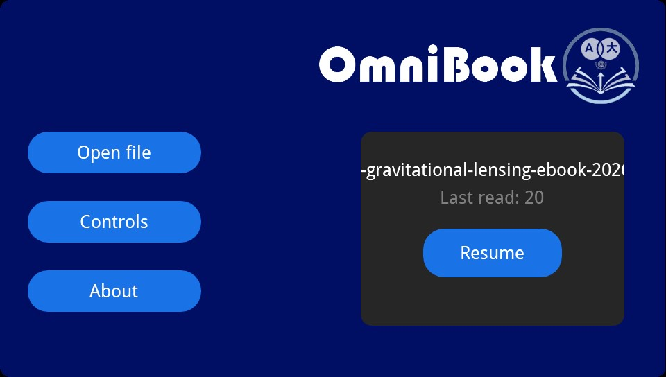
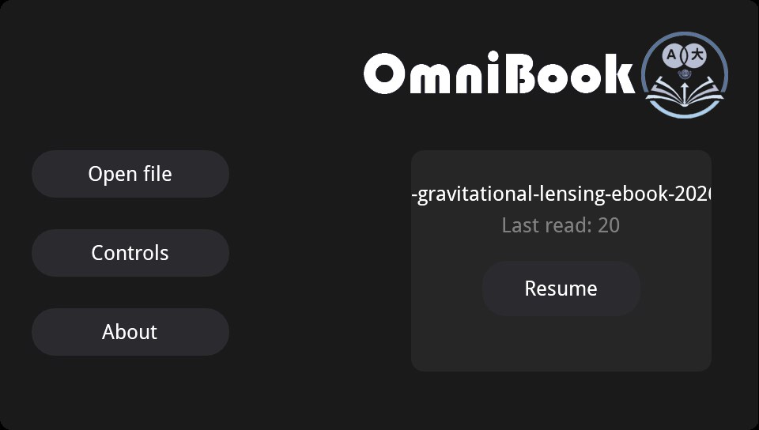
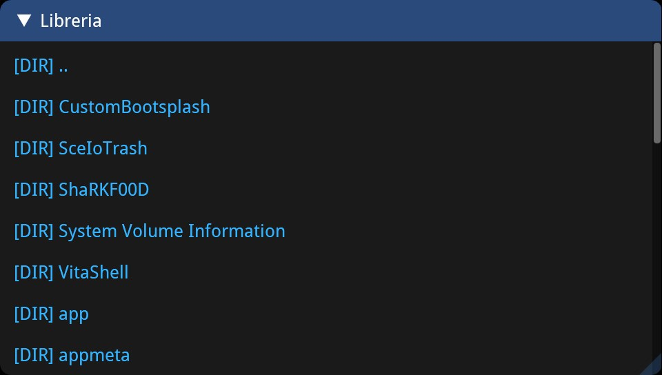

# OmniBook
## A book reader app for PSVITA with traslation support

### Introduction
OmniBook is an app for PSVITA written in C++. It uses the main following libraries:
- **MuPDF**: so it can read PDF, EPUB, MOBI, CBZ, CBR e XPS
- **SDL2**: for graphics and input
- **ImGui**: for widgets and windows
- **fmt**: for *std::format* support
- **nlohmann/json**: for json support

### Building
If you want to build this app from source code, you need to extract the libmupdf.a from its tz archive. 

### Features
The **traslation support** is acheived through *SceHttp* and *Google traslate*. You can traslate a single word or the whole page. Supported languages are: Italian, English, Spanish, French and German.
Everything in this app works by front touch.
There is a **night mode** and an **automatic save** of your reading progress.
For now **NO ZOOM OR ROTATION SUPPORT**.

### Controls
- **X**: to toogle night mode. You can do that in the home and while you are reading
- **SELECT**: to show a useful UI while you are reading
- **L**: to load previous page
- **R**: to load next page
- **front touch**: to use widget and scrolling pages like a smartphone

# MEDIA 

https://github.com/user-attachments/assets/390ee1e3-64b5-4d27-8f2b-8b95d7574576

# Credits:
- [MuPDF](https://mupdf.com/)
- [upstream imgui](https://github.com/ocornut/imgui)
- [SDL2](https://github.com/libsdl-org/SDL)
- [vitasdk](https://github.com/vitasdk)
- [fmt](https://github.com/fmtlib/fmt)
- [nlohmann/json](https://github.com/nlohmann/json)
